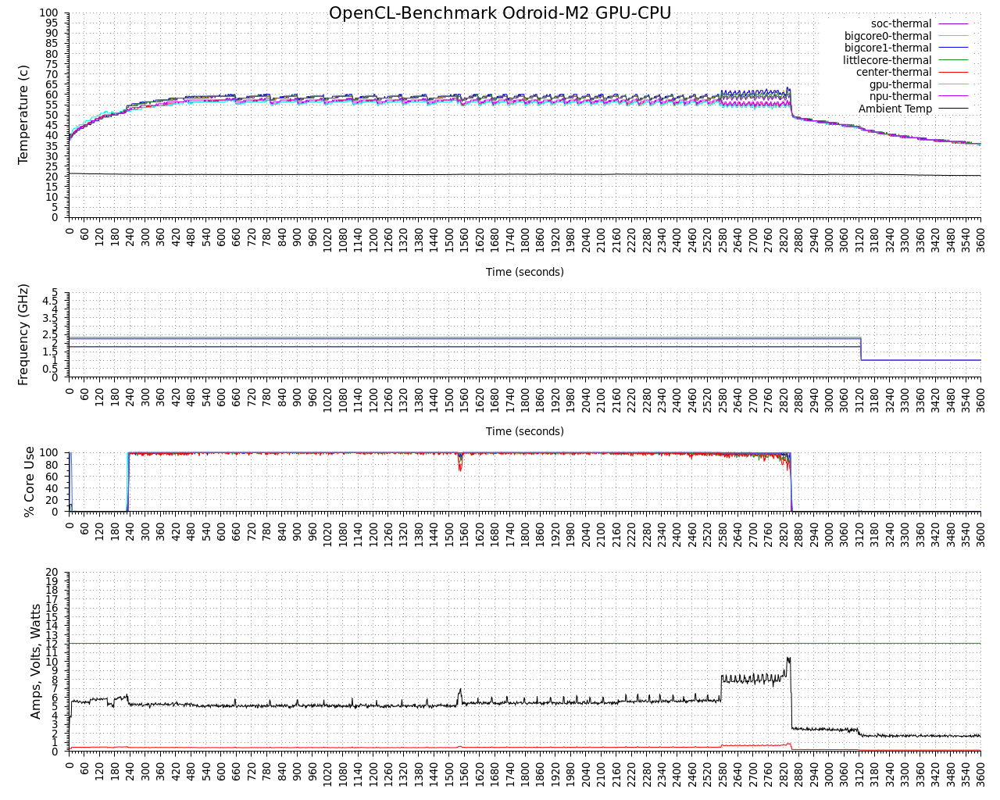

# logenv


## Introduction
logenv is a Linux command-line utility for the aggregating, logging and charting of timestamped CPU core frequency, thermal zone temperatures, ambient temperature, CPU core usage and volts, amps and watts from a Hard Kernel SmartPower2 or SmartPower3.  It can also generate GNUplot scripts for any collected data set. A typical data collection and charting workflow example:

Every 2 seconds collect the CPU frequency, thermal zone temperatures, ambient temperature, CPU usage and SmartPower3 Volt, Amp and Watts
```
./logenv -l ocl-m2_g610-a76_1.csv -i 2000 -f -t --mcp9808 -u -p /dev/ttyUSB0
```

Generate the GNUplot script
```
./logenv -g ocl-m2_g610-a76_1.gpl --title "OpenCL-Benchmark Odroid-M2 GPU-CPU" --xmtics 60 -i 2000 -f -t --mcp9808 -u -p
```

Generate the chart
```
gnuplot -c ocl-m2_g610-a76_1.gpl ocl-m2_g610-a76_1.png ocl-m2_g610-a76_1.csv
```



License: GPLv3.

### Install
```
  git clone https://github.com/hominoids/logenv.git
  cd logenv
  make
```

  
## Usage
```
logenv [options]

logenv - Version 0.98 pre release Copyright (C) 2019,2020,2024 by Edward Kisiel
logs count or time stamp, CPU frequency, thermal zone temperatures,
external sensor temperature, volts, amps and watts and CPU core usage.

usage: logenv [options]

Options:
 -l,  --log <file>            Log to <file>
 -i,  --milliseconds <number> Poll Interval <number> in milliseconds
 -f,  --frequency             CPU core frequency
 -t,  --temperature           Thermal zone temperature
 -a,  --bme280 <device>       Ambient Temperature Sensor, BME280 Temperature Sensor default /dev/i2c-0
      --bmp180 <device>       BMP180 Temperature Sensor, default /dev/i2c-0
      --mcp9808 <device>      MCP9808 Temperature Sensor, default /dev/i2c-0
 -p,  --smartpower3-ch1 <tty> Volt, Amp, Watt (HK SmartPower3 USBC port), default /dev/ttyUSB0
      --smartpower3-ch2 <tty>
      --smartpower2 <tty>     Volt, Amp, Watt (HK SmartPower2 microUSB port), default /dev/ttyUSB0
 -u,  --usage                 CPU core usage, aggregate and core 0 to core n-1
 -d,  --date                  Date and Time stamp
 -r,  --raw                   Raw output, no formatting of freq. or temp.  e.g. 35000 instead of 35
 -v,  --verbose               Readable dashboard output
 -q,  --quiet                 No output to stdout
 -g,  --gnuplot <file>        Gnuplot script generation
      --title <string>        Chart title <string>
      --xmtics <number>       Chart x-axis major second tics <number>
      --version               Version
 -h,  --help                  Help screen
```

### Examples
```
Data capture every 2 seconds:
logenv -l logfile.csv -i 2000 -f -t -a /dev/i2c-1 -p /dev/ttyUSB0

Gnuplot script generation for data capture:
logenv -g gplotscript.gpl --title "logenv GNUPlot Chart" --xmtics 60 -i 2000 -f -t -a -p

Gnuplot chart creation:
gnuplot -c gplotscript.gpl chart.png logfile.csv
```
