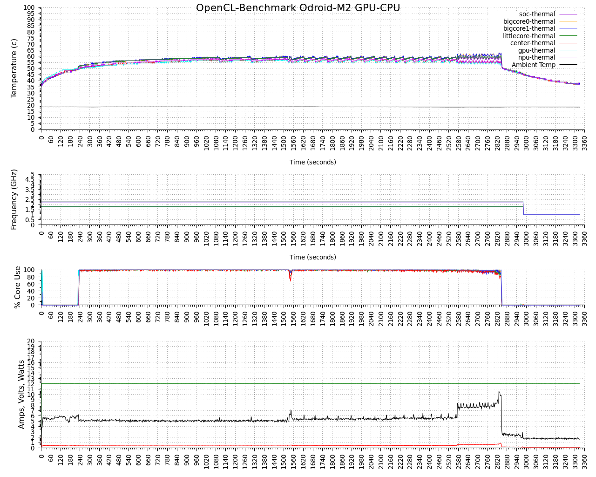

# logenv


## Introduction
logenv is a Linux command-line utility for the aggregating, logging and charting of timestamped CPU core frequencies, thermal zone temperatures, ambient temperature, CPU core usage and volts, amps and watts from a Hard Kernel SmartPower2 or SmartPower3.  It can also generate GNUplot scripts for any collected data set. 



License: GPLv3.


### Install
```
  git clone https://github.com/hominoids/logenv.git
  cd logenv
  make
```

  
## Usage
```
logenv [options]

logenv - Version 0.98 Copyright (C) 2019,2020,2024 by Edward Kisiel
logs count or time stamp, CPU frequency, thermal zone temperatures,
external sensor temperature, volts, amps and watts and CPU core usage.

usage: logenv [options]

Options:
 -l,  --log <file>            Log to <file>
 -i,  --milliseconds <number> Poll Interval <number> in milliseconds
 -f,  --frequency             CPU core frequency
 -t,  --temperature           Thermal zone temperature
 -a,  --bme280 <device>       Ambient Temperature Sensor, BME280 Temperature Sensor default /dev/i2c-0
      --bmp180 <device>       BMP180 Temperature Sensor, default /dev/i2c-0
      --mcp9808 <device>      MCP9808 Temperature Sensor, default /dev/i2c-0
 -p,  --smartpower3-ch1 <tty> Volt, Amp, Watt (HK SmartPower3 USBC port), default /dev/ttyUSB0
      --smartpower3-ch2 <tty>
      --smartpower2 <tty>     Volt, Amp, Watt (HK SmartPower2 microUSB port), default /dev/ttyUSB0
 -u,  --usage                 CPU core usage, aggregate and core 0 to core n-1
 -d,  --date                  Date and Time stamp
 -r,  --raw                   Raw output, no formatting of freq. or temp.  e.g. 35000 instead of 35
 -v,  --verbose               Readable dashboard output
 -q,  --quiet                 No output to stdout
 -g,  --gnuplot <file>        Gnuplot script generation
      --title <string>        Chart title <string>
      --xmtics <number>       Chart x-axis major second tics <number>
      --version               Version
 -h,  --help                  Help screen
```


## Example
This example is a typical data collection and charting workflow:

Every 2 seconds collect the CPU frequency, thermal zone temperatures, ambient temperature, CPU usage and SmartPower3 Volt, Amp and Watts
```
./logenv -l ocl-m2_g610-a76_1.csv -i 2000 -f -t --mcp9808 -u -p
```

Generate the GNUplot script
```
./logenv -g ocl-m2_g610-a76_1.gpl --title "OpenCL-Benchmark Odroid-M2 GPU-CPU" --xmtics 60 -i -f -t --mcp9808 -u -p
```

Generate the chart
```
gnuplot -c ocl-m2_g610-a76_1.gpl ocl-m2_g610-a76_1.png ocl-m2_g610-a76_1.csv
```


## SmartPower Settings
Settings for the Hard Kernel SmartPower3 and SmartPower2 are baud rate 115200,8N1 with no HW or SW control.


## GNUPlot Charts
Single or stacked charts are created based on the type and number of datum that are contained in the data set.  Core Frequency, Thermal Zone Temperatures, CPU core usage and SmartPower data can all be charted with the addition of Ambient Temperature when Thermal Zone Temperatures are also charted.  When a GNUPlot Script file is generated, part of it's contents is based on the number of CPU cores and the number and name of thermal Zones.  For this reason the GNUPlot script needs to be generated on the machine the data was collected from if any of those datum are included.  The GNUPlot Scripts or .gpl files can be reused and don't need to be regenerated if the type of data being collected and the machine are the same.


## Compatibility
logenv has been tested with both a HK SmartPower2 and SmartPower3, including MCP9808 and BME280 sensors.  Several architectures have been test including Armv7, Armv8, Armv9 and different generations of INTEL and AMD processor up to 32 cores.  There is no limitation on the number of cores or thermal zones with the exception of the usage option which supports up to 256 cores.  It has also been used on several Linux distributions including Ubuntu, Debian, Manjaro and Arch.  It should run on just about anything that runs Linux.
