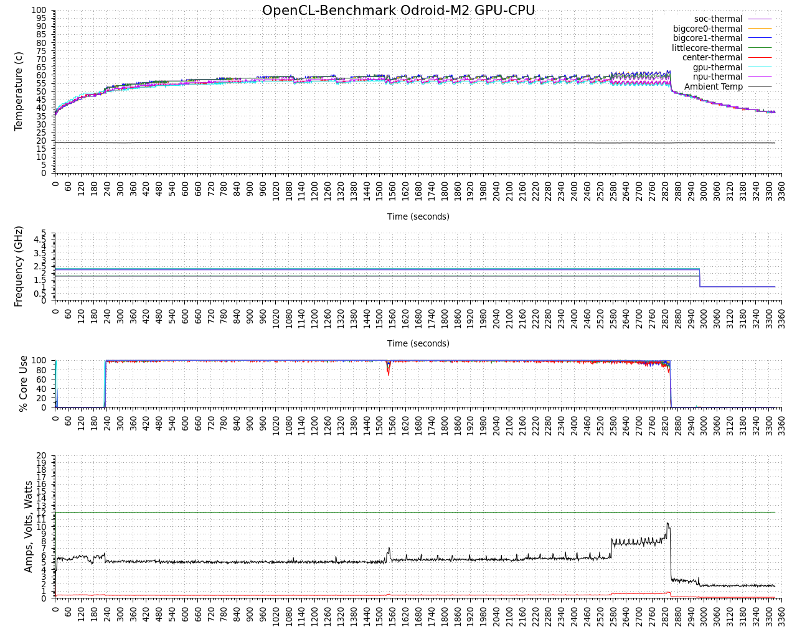

# logenv

This is a development branch and a work in progress that is not fully documented yet.  The original Logenv is available on the classic branch or as release v1.0. 

## Introduction
logenv is a Linux command-line utility for the aggregating, logging, charting and displaying of timestamped CPU core frequencies, thermal zone temperatures, ambient temperature, CPU core usage, memory usage, sensors data and volts, amps and watts, from a HardKernel SmartPower2 or SmartPower3, as a single-shot or continuos interval based feed.  Many sensors are supported and logenv can also generate GNUplot scripts for any collected data set as well as a UDP network stream. Local display of data on small oled and eInk displays is supported for the SSD1306, SH1107, SSD1681 and ST7789 controllers. 



License: GPLv3.


### prerequisite
Any OS repository version of cjson should work but gpiod version 2.x is not supported at this time.  If gpiod version 1.x is not available in your repository then compile gpiod v1.64 from source.

gnuplot

cjson
https://github.com/DaveGamble/cJSON

gpiod v1.x
https://libgpiod.readthedocs.io/en/stable/

````
wget https://mirrors.edge.kernel.org/pub/software/libs/libgpiod/libgpiod-1.6.4.tar.xz
tar -xvf ./libgpiod-1.6.4.tar.xz
cd ./libgpiod-1.6.4/
./configure --enable-tools
make
sudo make install
sudo ldconfig /usr/local/lib
````

### Install
```
  git clone https://github.com/hominoids/logenv.git
  cd logenv
  make
```

  
## Usage
```
usage: logenv [options]

Options:
 -l,  --log <file>            Log to <file>
 -i,  --milliseconds <number> Poll Interval <number> in milliseconds
 -f,  --frequency             CPU core frequency
 -t,  --temperature           Thermal zone temperature
 -a,  --bme280 <device>       Temperature, Humidity, Pressure Sensor I2C 0x76 or 0x77 default /dev/i2c-0
      --bmp180 <device>       Barometric Pressure, Altitude & Temperature Sensor default /dev/i2c-0
      --bmp388 <device>       Barometric Pressure, Altitude & Temperature Sensor I2C 0x76 or 0x77
      --bmp390 <device>       Barometric Pressure, Altitude & Temperature Sensor I2C 0x76 or 0x77
      --mcp9808 <device>      High Accuracy Temperature Sensor I2C 0x18 default /dev/i2c-0
      --sht4x <device>        Temperature and Humidity I2C 0x44 default /dev/i2c-0
      --shtc3 <device>        Temperature and Humidity I2C 0x70 default /dev/i2c-0
      --aht20 <device>        Temperature and Humidity I2C 0x70 default /dev/i2c-0
      --htu31d <device>       Temperature and Humidity I2C 0x40 default /dev/i2c-0
 -p,  --smartpower3-ch1 <tty> Volt, Amp, Watt (HK SmartPower3 USBC port), default /dev/ttyUSB0
      --smartpower3-ch2 <tty>
      --smartpower2 <tty>     Volt, Amp, Watt (HK SmartPower2 microUSB port), default /dev/ttyUSB0
 -u,  --usage                 CPU core usage, aggregate and core 0 to core n-1
 -m,  --memory                Physical memory usage (total - available, see man free)
 -d,  --date                  Date and Time stamp
 -r,  --raw                   Raw output, no formatting of freq. or temp.  e.g. 35000 instead of 35
 -v,  --verbose               Readable dashboard output
 -q,  --quiet                 No output to stdout
 -o,                          Output to eInk/Oled/LCD display using logenv.json
 -n,  --udp <host>:<port>     UDP output to <host>:<port>
 -s,  --sgp30 <device>        VOC and eCO2 Sensor I2C 0x58 default /dev/i2c-0
      --scd30 <device>        CO2 Temperature and Humidity Sensor I2C 0x61 default /dev/i2c-0
      --scd41 <device>        CO2 Temperature and Humidity Sensor I2C 0x62 default /dev/i2c-0
 -g,  --gnuplot <file>        Gnuplot script generation
      --title <string>        Chart title <string>
      --xmtics <number>       Chart x-axis major second tics <number>
      --version               Version
 -h,  --help                  Help screen
```


## Example
This example is a typical data collection and charting workflow:

Every 2 seconds collect the CPU frequency, thermal zone temperatures, ambient temperature, CPU usage and SmartPower3 Volt, Amp and Watts
```
./logenv -l ocl-m2_g610-a76_1.csv -i 2000 -f -t --mcp9808 -u -p
```

Generate the GNUplot script
```
./logenv -g ocl-m2_g610-a76_1.gpl --title "OpenCL-Benchmark Odroid-M2 GPU-CPU" --xmtics 60 -i -f -t --mcp9808 -u -p
```

Generate the chart
```
gnuplot -c ocl-m2_g610-a76_1.gpl ocl-m2_g610-a76_1.png ocl-m2_g610-a76_1.csv
```


## SmartPower Settings
Settings for the Hard Kernel SmartPower3 and SmartPower2 are baud rate 115200,8N1 with no HW or SW control.

## Sensor Support
Many types of sensors are directly supported using built in drivers and require no other setup.  At this time only I2C access is available for those that also have a SPI interface.

AHT20 - Temperature & Humidity I2C ADD 0x38

HTU31 - Temperature & Humidity I2C ADD 0x40

SHT40,SHT41,SHT43,SHT45 - Temperature & Humidity I2C ADD 0x44

SHTC3 - Temperature & Humidity I2C ADD 0x70

MCP9808 - High Accuracy Temperature Sensor I2C ADD 0x18


BME280 - Barometric Pressure, Altitude, Temperature & Relative Humidity, ADD 0x76 or 0x77

BME680 - Barometric Pressure, Altitude, Temperature, Relative Humidity & VOC ADD 0x76 or 0x77


BMP180 - Barometric Pressure, Altitude and Temperature

BMP388 - Barometric Pressure, Altimeter and Temperature I2C ADD 0x76 or 0x77

BMP390 - Barometric Pressure, Altimeter and Temperature I2C ADD 0x76 or 0x77


SCD30 - NDIR True CO2 (400ppm – 10,000ppm), Temperature and Humidity Sensor ADD 0x61

SCD40,SCD41,SCD43 - True CO2, Temperature and Humidity Sensor ADD 0x62

SGP30 - VOC and eCO2 I2C ADD 0x58


## GNUPlot Charts
Single or stacked charts are created based on the type and number of datum that are contained in the data set.  Core Frequency, Thermal Zone Temperatures, CPU core usage and SmartPower data can all be charted with the addition of Ambient Temperature when Thermal Zone Temperatures are also charted.  When a GNUPlot Script file is generated, part of it's contents is based on the number of CPU cores and the number and name of thermal Zones.  For this reason the GNUPlot script needs to be generated on the machine the data was collected from if any of those datum are included.  The GNUPlot Scripts or .gpl files can be reused and don't need to be regenerated if the type of data being collected and the machine are the same.

## UDP Client
The UDP client -n option is followed by the server host and port <host:port>. The host entry can be either an IP address or host name.  Make sure the port is open if using a firewall.  From the command-line on the server host system, netcat can be used to read the UDP feed.

```
netcat -l -u -p <port>
```

## Display Configuration
The display configuration file logenv.json is a JSON formatted file that describes a display, its pages and items for each page.  The current working directory is searched first (./logenv.json) and then /etc/logenv/logenv.json.
Multiple displays are supported with each capable of multiple pages containing time, date, system information or sensor data. 

### JSON Format

```
{
"displays": [
    {
        "name": "ssh1107",
        "device": "/dev/i2c-0",
        "address": 61,
        "xsize": 128,
        "ysize": 128,
        "rotation": 0,
        "page": 0,
        "seconds": 60,
        "content": [
            {
            "name": "time",
            "device": "",
            "address": 0,
            "type": "12",
            "xloc": 25,
            "yloc": 5,
            "color": 0,
            "font": "MONOSPACE_36",
            "label": "",
            "unit": ""
            },
            {
            "name": "date",
            "device": "",
            "address": 0,
            "type": "short",
            "xloc": 20,
            "yloc": 30,
            "color": 0,
            "font": "MONOSPACE_12",
            "label": "",
            "unit": ""
            },
            {
            "name": "mcp9808",
            "device": "/dev/i2c-0",
            "address": 24,
            "type": "F",
            "xloc": 0,
            "yloc": 99,
            "color": 0,
            "font": "MONOSPACE_24",
            "label": "",
            "unit": ""
            },
            {
            "name": "mcp9808",
            "device": "/dev/i2c-0",
            "address": 24,
            "type": "C",
            "xloc": 80,
            "yloc": 100,
            "color": 0,
            "font": "MONOSPACE_16",
            "label": "",
            "unit": "c"
            }
        ]
    }
  ]
}
```


### Display Page Commands
**date**
```
    COMMAND: date
DESCRIPTION: displays date at xloc, yloc using font.
       TYPE: default, short, long
	{
	"name": "date",
	"device": "",
	"address": 0,
	"type": "long",
	"xloc": 10,
	"yloc": 40,
	"color": 0,
	"font": "DEFAULT_16",
	"label": "",
	"unit": ""
	},
	
```

**time**
```
    COMMAND: time
DESCRIPTION: displays time at xloc, yloc using font.
       TYPE: default, 12, 24
	{
	"name": "time",
	"device": "",
	"address": 0,
	"type": "24",
	"xloc": 10,
	"yloc": 40,
	"color": 0,
	"font": "MONOSPACE_36",
	"label": "",
	"unit": ""
	},
```


**frequency**
```
    COMMAND: frequency
DESCRIPTION: displays core frequencies at xloc, yloc using font.
       TYPE: default, 12, 24
	{
	"name": "frequency",
	"device": "",
	"address": 0,
	"type": "",
	"xloc": 10,
	"yloc": 40,
	"color": 0,
	"font": "MONOSPACE_16",
	"label": "",
	"unit": ""
	},
```


thermal - partially completed
memory - partially completed
usage - partially completed
governor - wip
disk - wip
host - wip
ip - wip
uptime - wip
text - wip
line - wip
circle - wip
rectangle - wip
point - wip
background - wip
image - wip

### -Builtin Sensor Drivers-
AHT20,HTU31,SHT40,SHT41,SHT43,SHT45,SHTC3,MCP9808,BME280,BME680,BMP180,BMP388,BMP390,SCD30,SCD40,SCD41,SCD43,SGP30

7-bits I2C address in decimal e.g. 119 = 0x77

***sensor***
```
    COMMAND: *sensor name*
DESCRIPTION: displays sensor datum at xloc, yloc using font.
       TYPE: C
       
     		C = Celsius
			F = Fahrenheit
			H = Humidity
			P = Pressure
			G = Gas
			V = VOC
        {
        "name": "bme680",
        "device": "/dev/i2c-1",
        "address": 119,
        "type": "C",
        "xloc": 5,
        "yloc": 50,
        "color": 0,
        "font": "DEFAULT_12",
        "label": "",
        "unit": "c"
        },
```


### Tested Displays
Basic display capability has not been fully implemented so only limited display tests have been performed.  More testing will occur as development proceeds.

 ssd1681 AdaFruit 4196 1.54" Monochrome 200x200 eInk / ePaper Display
 
 ssd1306 Odroid-HC4 Monochrome 128x64 OLED graphic display
 
 ssd1306 AdaFruit 938 Monochrome 1.3" 128x64 OLED graphic display
 
 sh1107 AdaFruit 5297 Monochrome 1.12" 128x128 OLED graphic display
 
 st7789 AdaFruit 3787 Color 1.54" 240x240 Wide Angle TFT LCD display
 
 
## Compatibility
logenv has been tested with both a HardKernel SmartPower2 and SmartPower3, including MCP9808 and BME280 sensors.  Several architectures have been test including Armv7, Armv8, Armv9 and different generations of INTEL and AMD processor up to 32 cores.  There is no limitation on the number of cores or thermal zones with the exception of the usage option which supports up to 256 cores.  It has also been used on several Linux distributions including Ubuntu, Debian, Manjaro and Arch.  It should run on just about anything that runs Linux.
